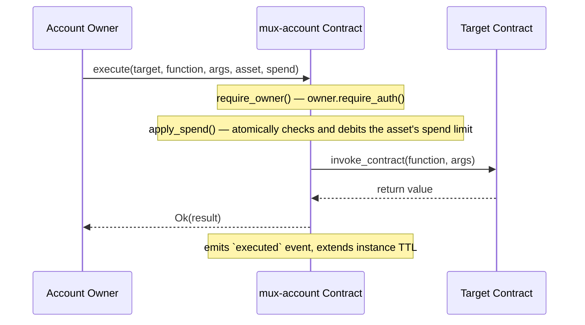

# Account Abstraction (AA) Sequence Diagrams

`mux-account` implements two distinct execution paths. There is no
`EntryPoint`, `Bundler`, `Paymaster`, or `UserOperation` concept anywhere in
this codebase — those are ERC-4337 (Ethereum) terms and do not apply here.
This document was previously written as a generic ERC-4337 diagram; it now
reflects what the Soroban contract actually implements.

## Owner-authorized execution (`execute`) — fully implemented

This is the only path that currently dispatches a payload to a target
contract. The owner signs directly; the spend limit is enforced atomically
around the cross-contract call.



## Session-key execution (`execute_with_session`) — validation only, no dispatch

This is the account-abstraction-style path: an owner pre-authorizes a
session key out of band, and a third party (a relayer, a dApp backend) later
acts using that session key without the owner signing each call. **As
currently implemented, this path validates the session key but does not
execute anything against a target contract.**

```mermaid
sequenceDiagram
    participant Owner as Account Owner
    participant Account as mux-account Contract
    participant Relayer as Relayer / dApp (holds session key)

    Owner->>Account: register_session_key(session_key, expires_at, scopes)
    Note over Account: owner-authorized; stores SessionKeyRecord { expires_at, scopes, revoked: false }

    Relayer->>Account: execute_with_session(session_key, payload)
    Note over Account: session_key.require_auth()
    Note over Account: looks up SessionKeyRecord; rejects if missing, revoked, or expired
    Note over Account: payload is never decoded or dispatched — `scopes` are stored but not checked
    Account-->>Relayer: Ok(empty Bytes)
    Note over Account: emits `ses_exe` event (session_key, payload_len only), extends instance TTL
```

## Current vs. intended behavior

| Step | This document previously implied | What `execute_with_session` actually does |
|---|---|---|
| Signature/nonce validation | `EntryPoint.validateUserOp` against a `UserOperation` | `session_key.require_auth()` plus a `SessionKeyRecord` lookup (revoked/expiry check only) — no `UserOperation` or nonce concept exists |
| Gas sponsorship | Optional `Paymaster.validatePaymasterUserOp` / `postOp` | Not implemented; no paymaster concept exists in this codebase |
| Payload execution | `EntryPoint.execute(dest, value, callData)` against a target contract | **Stub** — `payload` is read only for its length (for the audit event); no `env.invoke_contract` call is made, no target is invoked |
| Scoped authorization | Implied per-call capability check | `SessionKeyRecord.scopes: Vec<Scope>` is stored at registration but never read or enforced during `execute_with_session` |
| Result | Transaction receipt reflecting real execution | `Ok(Bytes::new(&env))` — an empty success value returned unconditionally on the happy path, regardless of what `payload` contained |

This is tracked as a known gap (see `docs/abi_reference.md`'s `mux-account`
method table and `docs/mux-account-interface.md`). Closing it requires design
work on how `payload` should be decoded and dispatched, and how `scopes`
should gate which calls a session key may make — that work is out of scope
for a documentation fix and should be tracked as its own contract change.
